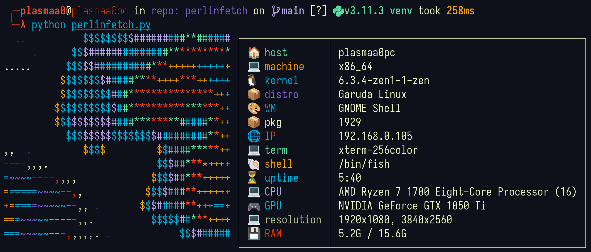

# PerlinFetch



`PerlinFetch` is a system fetch program that displays beautifully colored perlin noise amongst system information in a nice table. This program is useful for anyone who wants to monitor their system's performance on a regular basis while enjoying a visually pleasing display.

## Installation
To install PerlinFetch, follow these steps:

1. Clone the repository to your local machine.
```bash
git clone https://github.com/Plasmaa0/perlinfetch.git
```
2. Navigate to the cloned directory.
```bash
cd perlinfetch
```
3. Execute bash script that will create python virtual environment and install dependencies
```bash
./setup.sh
```
4. Paste the line given by setup.sh into your shell config. It will look like this:
```
/home/YOUR_USERNAME/PATH_TO_REPO/venv/bin/python /home/YOUR_USERNAME/PATH_TO_REPO/perlinfetch.py
```

# License
This project is licensed under the MIT License. Feel free to use and modify it however you like.